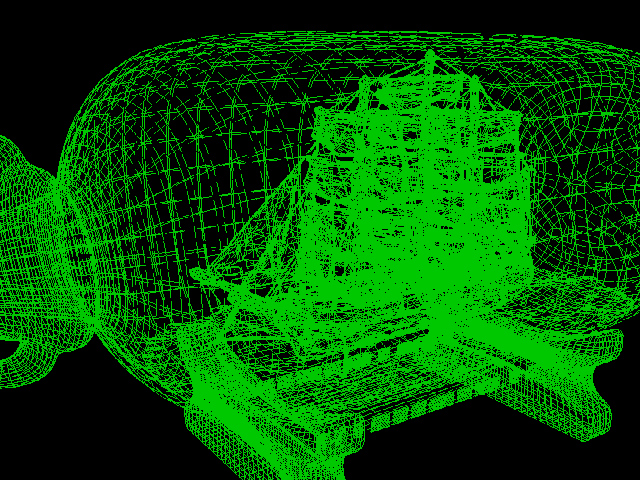

# 3DViewer v1.0

3DViewer v1.0.

## Contents
1. [Appearance](#appearance)
2. [Building project](#building-project)

 

## [Appearance](#3dviewer-v10)

  

## [Building project](#building-project)
`Makefile`:
| #  | Target             | Description of the target                                                 |
|----| ------------------ | ------------------------------------------------------------------------- |
| 1  | `all`              | Builds the project                                 |
| 2  | `install`          | Builds the project                                                        |
| 3  | `uninstall`        | Uninstalls the project                                                    |
| 4  | `clean`            | Cleans the repository of generated files                                  |
| 5  | `dependencies`     | Installs the necessary dependencies for building and testing the project  |
| 6  | `run`              | Launch the app                                                            |
